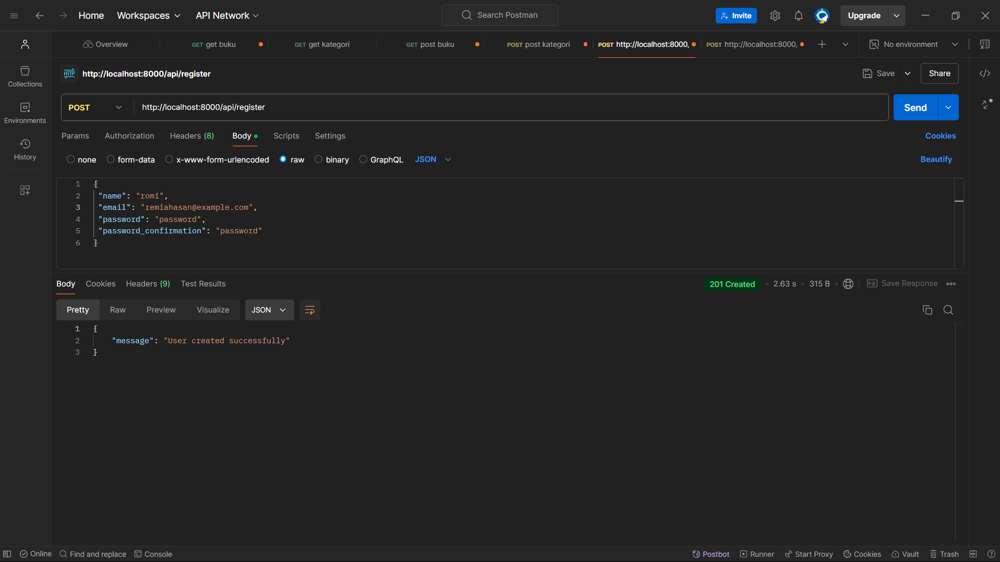

untuk menambahkan fitur memperbarui profil pengguna saya function updateProfile programnya seperti berikut:

setelah menambahkan function updateProfile saya menambahkan route untuk mengarahkan ke function updateProfile

agar bisa menghapus user dengan admin saya harus membuat UserController terlebih dahulu setelah itu saya mengimplementasikan function destroy didalam user controler seperti berikut:

setelah itu saya menambahkan route untuk menghapus pengguna

agar bisa mengambil daftar semua pengguna dan hanya bisa di akses oleh admin pertama saya menambahkan function index di userController seperti berikut ini:

setelah itu saya menambahkan root untuk mengakses daftar semua pengguna
